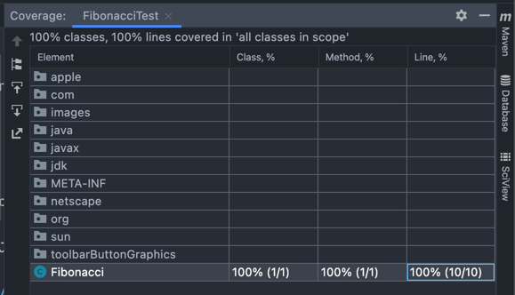
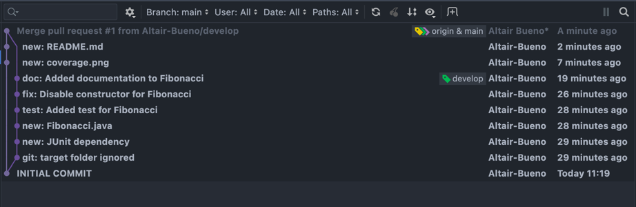

# Fibonacci para Mantenimiento y Pruebas del Software

Repositorio para la asignatura Mantenimiento y Pruebas del Software de la
Universidad de Málaga

# Anotaciones sobre la entrega

- Ya que no se especifican requisitos para la implementación, he optado por
  utilizar `BigInteger` para evitar problemas de overflow
- La implementación **NO** es recursiva, ya que el compilador de Java es incapaz
  de
  realizar [Tail Recursion Optimization](https://en.wikipedia.org/wiki/Tail_call)
- Ante una entra inválida, el programa devolverá `null`
- [commits.png](commits.png) utiliza el visualizador de IntelliJ IDEA. No tengo
  Gitkraken ni SourceTree instalados. Considero que son innecesarios para
  realizar esta entrega

# Images

## Coverage

## Commits

